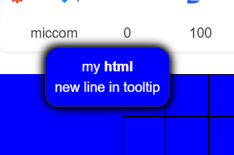

# vue3Tooltip Component for vue3 handling tooltips with descriptions of elements.

In the component configuration, you can set:
```js
// configuration tooltip
const config = {
    tooltipAttribute: 'title', // Attribute used for displaying text in the tooltip.
    event: 'mousemove' // Event on which the tooltip is triggered.
};
```
which element attribute should be treated as the content/code to be placed in the tooltip.
-- title
-- description
-- any element attribute

which event should the component react to:
-- mouseenter - the tooltip generates once and remains in place; upon leaving the element, the tooltip disappears.
-- mousemove - the tooltip follows the mouse cursor; upon leaving the element, the tooltip disappears.
-- other events, not tested but should work correctly.

In the tooltip, you can apply simple HTML, as well as add images, build a table in the tooltip (properly formatting the title attribute content).

Example:

```vue
<template>
  <button title="my <strong>html</strong><br>new line in tooltip">miccom</button>
</template>
<script>
import { TooltipDirective } from "@/directives/TooltipDirective.js";

export default {
    name: 'ExampleComponent',
    directives: {
        Tooltip: TooltipDirective
    }
};
</script>
<style>
</style>
```

Introducing such code will display such a tooltip:<br>


This tooltip follows the mouse cursor, dynamically positions itself on the screen, and if it doesn't fit at the top, it will appear below the element.

For tooltips, you can freely apply any styles.

I hope this little component will be useful to someone :)
I myself searched for and installed many others, but they were not satisfactory for me - hence the need to create something like this.
